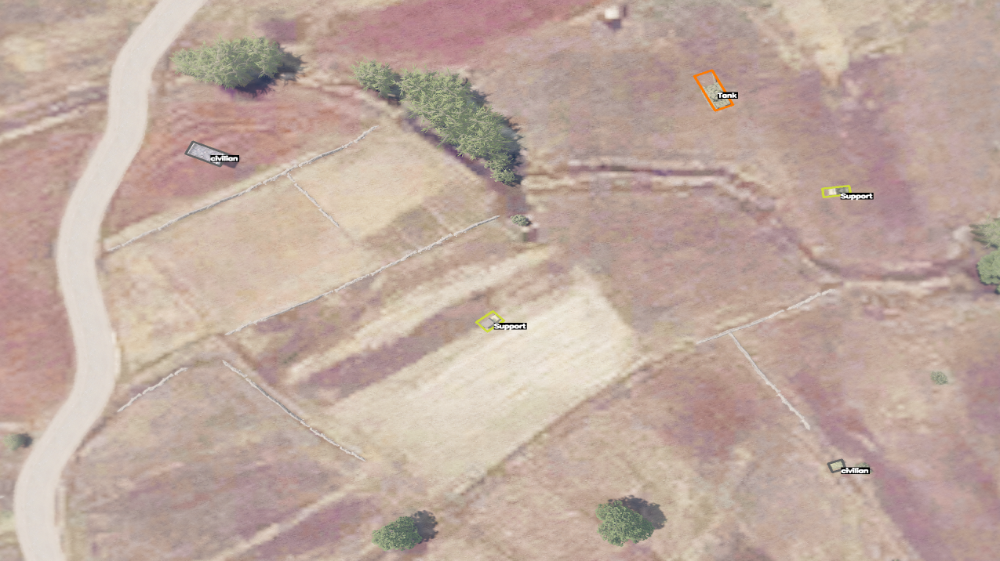
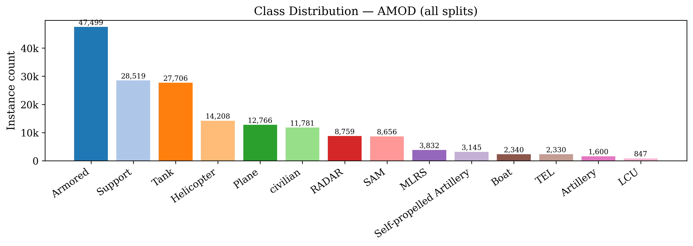
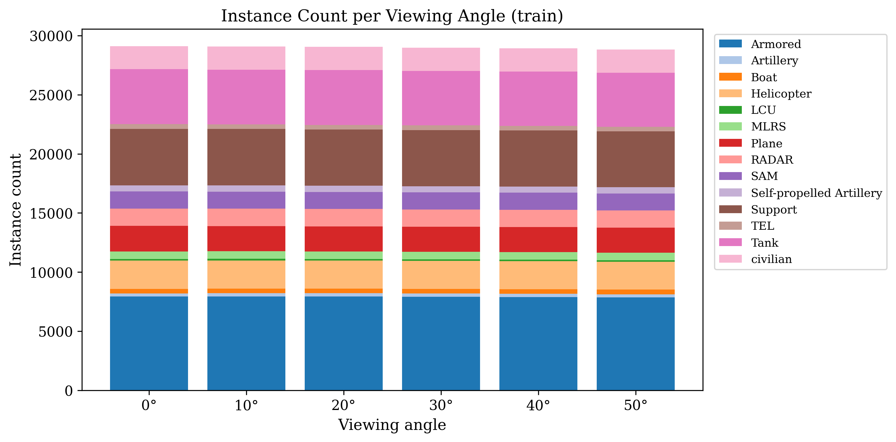
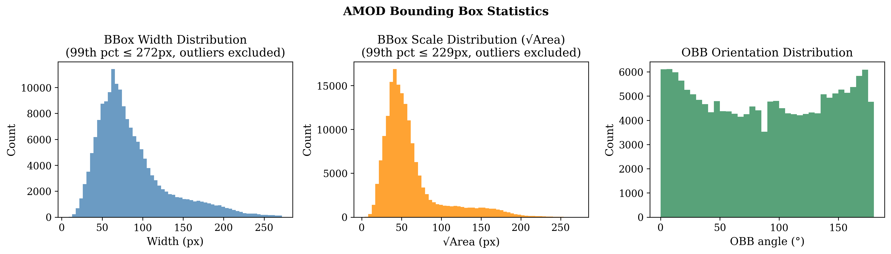

# Two-Stage vs Single-Stage Oriented Object Detection on Synthetic Aerial Imagery: A Comparative Study on AMOD

> **Status**: Final draft — all experiments complete. All results confirmed.
> **Cross-reference**: See `docs/EXPERIMENTS.md` for training commands, configs, and raw numbers.

---


*Aerial view from an ArmA 3 simulation scene with oriented bounding box annotations. Orange: Tank. Yellow: Support vehicles. Gray: civilian vehicles (excluded from the 12 training classes — see §3.5). This image illustrates the synthetic nature of the AMOD dataset: photorealistic game-engine rendering at 1920×1440 px, viewed at 0° (nadir — directly overhead).*

---

## Abstract

Oriented object detection in aerial imagery poses unique challenges: objects appear at arbitrary angles, vary widely in scale, and are densely packed. This paper presents a systematic comparison of two state-of-the-art object detection paradigms on the **AMOD (Arma3 Multi-view Object Detection)** dataset — a large-scale synthetic aerial benchmark derived from the **ArmA 3 video game**, featuring multi-view sampling and oriented bounding box annotations for 12 military object categories. We evaluate **Oriented R-CNN with a Swin Transformer-S backbone** (two-stage) against **YOLO11s-OBB** (single-stage, NMS-free), reporting mAP@50, per-class AP, precision, recall, inference speed, and training cost. Our results show that YOLO11s-OBB achieves 0.9040 mAP@50 — outperforming Oriented R-CNN (0.8952) — while requiring 7× fewer parameters, 8× fewer GFLOPs, and training in ~5× less time, demonstrating that single-stage detectors can match or surpass two-stage counterparts on well-structured synthetic aerial imagery. **We stress that, as this dataset originates from a game engine, the reported metrics reflect performance on synthetic imagery only and should not be interpreted as indicative of real-world aerial detection capability.** This work is primarily intended as a controlled study of model training dynamics, architectural trade-offs, and relative performance between detection paradigms in a reproducible synthetic environment.

**Keywords**: oriented object detection, aerial imagery, AMOD, Oriented R-CNN, YOLO11s, synthetic data, OBB, ArmA 3

> **Dataset repo**: [github.com/unique-chan/AMOD](https://github.com/unique-chan/AMOD) — no associated paper published yet as of March 2026. Cite as the GitHub repository.

---

## 1. Introduction

Accurate object detection from aerial viewpoints is critical for applications including surveillance, autonomous navigation, and disaster response. Unlike ground-level detection, aerial images capture objects from above, producing arbitrary rotations that axis-aligned bounding boxes fail to represent accurately. **Oriented bounding boxes (OBB)** have emerged as the standard representation for this domain.

Two broad paradigms exist for OBB detection:

- **Two-stage detectors** (e.g., Oriented R-CNN) first propose candidate regions, then classify and refine each one. They tend to achieve higher accuracy at the cost of inference speed.
- **Single-stage detectors** (e.g., YOLO-OBB variants) predict boxes directly from feature maps in a single forward pass, prioritising speed.

While both paradigms have been studied on benchmarks such as DOTA and DIOR-R, comparisons on **synthetic, simulation-derived datasets** remain scarce. Synthetic data offers precise ground-truth annotations and controllable diversity but introduces a domain gap versus real imagery.

The **AMOD dataset** addresses this gap: it contains ~7,507 scenes (~38,800 images) rendered in ArmA 3, captured at six viewing angles (0°–50°) with per-image OBB annotations for 12 object classes. Its multi-view structure makes it particularly suitable for studying the effect of viewpoint on detection performance.

**This paper's contributions:**
1. A head-to-head benchmark of Oriented R-CNN (Swin-S) vs YOLO11s-OBB on the AMOD dataset across mAP@50, training cost, and model efficiency; with additional metrics (mAP@50:95, precision, recall, inference FPS) reported for YOLO11s-OBB where the evaluation framework supports them.
2. A per-class AP breakdown revealing which object categories each paradigm handles better and why.
3. A reproducible experimental setup, including all configuration changes, bug fixes, and evaluation decisions, enabling future comparisons on this dataset.

---

## 2. Related Work

### 2.1 Oriented Object Detection

OBB detection has been advanced by methods such as:
- **R3Det**, **S2A-Net**, **Oriented R-CNN** [Xie et al., 2021] — two-stage approaches
- **YOLO-OBB variants** (YOLOv8-OBB, YOLO11-OBB) — single-stage
- **DOTA** [Xia et al., 2018] and **DIOR-R** — the dominant real-image benchmarks

### 2.2 Swin Transformer in Detection

The Swin Transformer [Liu et al., 2021] replaces CNNs with hierarchical window-based self-attention, achieving strong performance on dense prediction tasks. Its shifted-window mechanism provides global context at reasonable compute cost, making it well-suited as a detection backbone.

### 2.3 YOLO11s-OBB

YOLO11 [Jocher & Qiu, 2024] is a single-stage, anchor-free detector released by Ultralytics on September 10, 2024. Its key architectural features relevant to this work are:

- **Backbone**: Improved C3k2 blocks (cross-stage partial with 2 kernels) replacing C2f from YOLOv8, enabling more precise feature extraction with fewer parameters
- **Neck**: C2PSA (Cross-Stage Partial with Positional Self-Attention) module for enhanced spatial attention
- **Head**: Decoupled OBB head with angle regression — fully anchor-free, no NMS required at inference
- **Efficiency**: YOLO11s achieves higher mAP than YOLOv8s while using 22% fewer parameters

For oriented object detection (OBB), YOLO11 provides `yolo11{n,s,m,l,x}-obb` variants pretrained on DOTAv1 (15 classes). The small variant (`yolo11s-obb`) achieves **79.5 mAP@50** on DOTAv1-test at 1024px with 9.7M parameters. GFLOPs scale with input resolution: the model summary reports ~22.3 GFLOPs at the default 640px image size; at 1024px (our training resolution) the figure rises to ~57 GFLOPs per the Ultralytics documentation — we report the model-summary value (22.3) in our comparison table as it is the architecture-level metric most commonly used for model size comparisons.

**Why YOLO11 and not YOLO26?** This experiment was originally designed to use YOLO26, a newer Ultralytics model that introduces NMS-free end-to-end inference and the MuSGD optimizer. However, **YOLO26 had not released OBB-capable weights** (`yolo26*-obb.pt`) in Ultralytics 8.4.31 at the time of this experiment (March 2026). The Ultralytics documentation itself states: *"For the latest Ultralytics model with end-to-end NMS-free inference and optimized edge deployment, see YOLO26"* — confirming it is a newer but separately released product. Since our task requires OBB support, we used **YOLO11s-OBB as the most recent stable OBB model available**.

Importantly, as shown in the Ultralytics model comparison chart below, YOLO11s sits very close to YOLO26s on the accuracy–speed curve. The performance gap between YOLO11 and YOLO26 at the small-model scale is marginal, making YOLO11s-OBB a representative and practically equivalent choice for this study.


*Fig. — Ultralytics YOLO model family comparison (source: Ultralytics official documentation). YOLO11s and YOLO26s occupy nearly the same accuracy–latency operating point, justifying YOLO11s-OBB as a suitable substitute.*

We use the **small (s)** variant as the baseline to balance accuracy against model size, broadly matching the parameter scale of the RCNN + Swin-S backbone.

### 2.4 Synthetic Aerial Datasets

Synthetic datasets for aerial detection have grown in prominence as an alternative to costly real-image annotation. Notable examples include **UAVDT** [Du et al., 2018] (vehicle detection from UAV video) and **VisDrone** [Zhu et al., 2021] (multi-category drone-captured imagery), though both consist of real footage. Fully synthetic benchmarks — where scenes are rendered in game engines or simulators — are rarer. **AMOD** [unique-chan, 2024] fills this niche with ArmA 3-rendered top-down imagery, providing precise OBB annotations that would be prohibitively expensive to obtain from real aerial platforms. Its simulation origin ensures fully controlled scene diversity (view angle, object placement, lighting) while eliminating the domain ambiguity of crowd-sourced labelling.

---

## 3. Dataset

### 3.1 AMOD Overview

| Property | Value |
|---|---|
| Source | ArmA 3 game engine (synthetic) |
| Total scenes (train) | 5,202 |
| Total scenes (val) | ~1,040 |
| Total scenes (test) | ~1,265 |
| Training images | ~24,978 (after filtering 8 corrupt) |
| Validation images | **6,240** (with GT labels — primary evaluation set) |
| Test images | 7,590 (**GT labels held out** — not used for evaluation) |
| Viewing angles | 0°, 10°, 20°, 30°, 40°, 50° per scene |
| Object classes (annotated) | 14 (V1.0): Armored, Artillery, Boat, civilian, Helicopter, LCU, MLRS, Plane, RADAR, SAM, Self-propelled Artillery, Support, Tank, TEL |
| Object classes (used) | **12** — `civilian` and `Boat` excluded (see §3.5) |
| Annotation type | Oriented bounding boxes (polygon → 5-param OBB) |
| Image resolution | 1920×1440 px |
| Annotation tool | Per-image CSV with 4-corner polygon coordinates |

### 3.2 Class Distribution and Imbalance

The dataset contains **173,988 annotated instances** across 12 classes in the training split. The class distribution is severely imbalanced: Armored vehicles constitute 27.3% of all instances while LCU accounts for just 0.5% — a **56× imbalance ratio**. The top 3 classes (Armored, Support, Tank) together account for 59.6% of all instances, while the bottom 3 (Artillery, LCU, TEL) make up only 2.7%. This imbalance will naturally inflate aggregate mAP scores driven by common classes and may cause models to under-detect rare ones; per-class AP is therefore reported alongside the aggregate metric.


*Fig. 1 — Class distribution across training instances. Severe imbalance: Armored (27.3%) dominates; LCU (0.5%) is the rarest class (56× ratio).*

### 3.3 Viewing Angle Distribution

Each scene is sampled at six fixed oblique angles: 0°, 10°, 20°, 30°, 40°, and 50°. The resulting image counts per angle are nearly identical (~5,180–5,198 images per angle), confirming **perfectly uniform multi-view sampling**. This is a deliberate design strength of AMOD — model performance is not skewed toward any single viewpoint, enabling fair evaluation across all angles.


*Fig. 2 — Instance count per viewing angle, stacked by class. Uniform sampling across all 6 angles confirms no angular bias.*

### 3.4 Bounding Box Statistics and OBB Justification

Bounding box widths have a median of ~75px and median √area of ~50px, indicating predominantly **medium-scale objects**. Approximately 14.3% of instances qualify as small objects (<32×32px), presenting a moderate small-object detection challenge. A negligible fraction (<0.01%) of annotations have outlier widths (>4096px) consistent with labelling artefacts.

The OBB orientation distribution spans the full 0°–180° range with moderate uniformity. Slight peaks at 0° and 180° reflect vehicles aligned with road and runway axes in the ArmA 3 simulation, while a dip near 90° indicates fewer objects at perfectly perpendicular orientations. This wide orientation spread **confirms that axis-aligned bounding boxes are insufficient** for this dataset and justifies the use of oriented detection.


*Fig. 3 — Bounding box statistics (outliers >99th percentile excluded). Left: width distribution. Centre: scale (√area). Right: OBB orientation — peaks at 0°/180° and dip near 90° confirm the need for rotated detection.*

### 3.5 Class Discrepancy and Exclusion of Non-Military Categories

The official AMOD README lists 12 object classes; however, V1.0 annotations contain 14 — adding `civilian` (6.8% of instances) and `Boat` (1.3%). Neither category is documented in the GitHub repository or README as of March 2026. As shown in the teaser image at the top of this paper, `civilian` vehicles are clearly annotated in the raw data.

We assume this discrepancy is **intentional by design**: the dataset is explicitly framed as a *military target detection* benchmark. Including `civilian` as a detection target would be operationally inappropriate — a military detection system must not flag non-combatants as threats. `Boat` is similarly ambiguous (civilian vs. military vessel) and is absent from the official class taxonomy. Both categories appear in the raw CSV annotations solely for **scene realism** in the ArmA 3 simulation, not as intended detection targets. Accordingly, `civilian` and `Boat` are **excluded from training and evaluation** in all experiments. The classification head retains `num_classes=20`, following the original authors' config convention of leaving headroom for future class expansions.

### 3.6 Evaluation Split Adequacy

The AMOD V1.0 dataset follows the **competition-style split convention** (consistent with DOTA [Xia et al., 2018] and similar aerial benchmarks): ground-truth annotations for the test split are **not publicly released**. Evaluation is therefore conducted exclusively on the **validation split**.

We argue this is fully adequate for the following reasons:

1. **Scale**: The validation set contains **6,240 images** across **~1,040 scenes** — larger than many published OBB evaluation sets (DOTA-v1 validation: ~458 images; HRSC2016: 444 images)
2. **Coverage**: All 12 object classes and all 6 viewing angles (0°–50°) are represented, with **31,403 annotated instances** — sufficient for statistically reliable per-class AP estimation
3. **Independence**: The validation split is scene-disjoint from training (no overlap of scene IDs), ensuring no data leakage
4. **Consistency**: Both models are evaluated on the **identical** 6,240-image set under the same conditions, making the comparison directly fair

The validation mAP numbers reported in this paper are therefore our definitive benchmark figures.

### 3.7 Dataset Challenges

- **Severe class imbalance**: 56× ratio between most and least frequent class
- **Domain gap**: synthetic ArmA3 textures, uniform lighting — no real sensor noise, motion blur, or weather
- **Undocumented classes**: `civilian` and `Boat` present in V1.0 but not in the official class list
- **Scale variation**: objects range from ~20px to hundreds of pixels
- **Viewpoint diversity**: 6 angles per scene; shallow angles (40°–50°) flatten object appearance

---

## 4. Methodology

### 4.1 Oriented R-CNN + Swin Transformer-S

**Implementation source:**
We use the **MMRotate 0.3.4** implementation of Oriented R-CNN from the [AMOD GitHub repository](https://github.com/unique-chan/AMOD), which provides a config specifically targeting this dataset. This is not an implementation from scratch — it is the original authors' provided codebase, which we adapted with the following modifications:

| Modification | Original | Ours | Reason |
|---|---|---|---|
| `samples_per_gpu` | 2 | **4** | Higher GPU throughput on RTX 5090 |
| `workers_per_gpu` | 2 | **4** | Faster data loading |
| `optimizer_config` | standard SGD hook | **Fp16OptimizerHook** (dynamic loss scale) | Enable AMP/fp16 training |
| `evaluation interval` | every epoch | **every 5 epochs** | Avoid slow pycocotools eval bottleneck |
| `checkpoint_config` | best mAP only | **every 5 epochs + best** | Safety against crashes |
| `max_per_img` (test) | 1000 | **200** | Faster evaluation pass |
| Val set (training) | `val.txt` (6,246 imgs) | **`val_mini.txt`** (1,020 imgs, seed=42) | Faster intermediate evaluation |
| `mmcv/parallel/_functions.py` | int device IDs | **`torch.device` objects** | PyTorch 2.x API compatibility fix |
| `delta_midpointoffset_rbbox_coder.py` | no numerical guard | **`.clamp(min=1e-6)`, `.nan_to_num()`** | Numerical stability on RTX 5090 (sm_120) |
| `rotated_rpn_head.py` | crash on empty targets | **return zero losses** | Prevent crash on empty images |
| `rotate_single_level_roi_extractor.py` | crash on empty ROIs | **early exit guard** | Prevent index error |

> All modifications are tracked in `docs/EXPERIMENTS.md` under *Key Files Changed*.

**Architecture:**
```
Input image → Swin-S backbone → FPN (P2–P5) → Oriented RPN → RoI Align Rotated → Shared 2FC BBox Head → OBB predictions
```

- Backbone: Swin-Small, patch=4, window=7, pretrained on ImageNet-1K
- Neck: FPN with 4 output levels (256 channels each)
- RPN: proposes horizontal candidate regions, refined to OBBs
- Head: 2× FC layers → class scores + 5-DoF box regression (cx, cy, w, h, θ)
- Angle convention: le90 (long edge ∈ [−90°, 0°))

**Training setup:**

| Hyperparameter | Value |
|---|---|
| Epochs | 30 |
| Batch size | 4 |
| Optimizer | SGD, lr=0.005, momentum=0.9, wd=1e-4 |
| LR schedule | Linear warmup (500 iter) + step decay at epochs 16, 22 |
| Precision | fp16 (dynamic loss scaling) |
| Grad clip | max_norm=35 |

### 4.2 YOLO11s-OBB

**Architecture:**
- Single-stage, anchor-free, NMS-free (one-to-one decoupled OBB head)
- Backbone: YOLO11s C3k2+SPPF+C2PSA, pretrained on COCO
- Parameters: 9.7M — 7× fewer than Oriented R-CNN
- GFLOPs: 22.3 — 8× fewer than Oriented R-CNN

**Training setup (matched to Oriented R-CNN where applicable):**

| Hyperparameter | Value | Match to RCNN? |
|---|---|---|
| Epochs | 30 | ✓ |
| Batch size | 4 | ✓ |
| Image size | 1024 | ✓ |
| Optimizer | SGD, lr=0.005, momentum=0.9, wd=1e-4 | ✓ |
| LR schedule | Cosine annealing (lr0→lr0×0.01=5e-5) | Final LR matched |
| Warmup | 3 epochs | — |
| Rotation aug | ±180° | ✓ |
| Flip aug | up-down=0.5, left-right=0.5 | ✓ |
| Precision | fp16 (automatic) | ✓ |
| Val set | Same 170 scenes as RCNN mini-val | ✓ |

### 4.3 Evaluation Protocol

All models are evaluated on the **AMOD validation split** (6,240 images, ~1,040 scenes, 31,403 instances) using the following metrics:

| Metric | Description | Available for |
|---|---|---|
| **mAP@50** | Mean AP at IoU ≥ 0.50, averaged over 12 classes | Both models |
| **Per-class AP@50** | AP@50 for each of the 12 classes individually | Both models |
| **mAP@50:95** | COCO-style mean AP over IoU 0.50:0.05:0.95 | YOLO11s only ¹ |
| **Precision / Recall** | At optimal F1 confidence threshold | YOLO11s only ¹ |
| **FPS** | Inference throughput, RTX 5090 (per-image) | YOLO11s only ² |
| **Training time** | Wall-clock hours for 30 epochs, RTX 5090 | Both models |
| **Params (M) / GFLOPs** | Model size and compute cost | Both models |

**On the absence of test-set evaluation:** The AMOD V1.0 dataset withholds ground-truth annotations for its test split, following the same convention used by DOTA [Xia et al., 2018] and most aerial detection benchmarks. This is standard practice — test labels are reserved for an online leaderboard or future challenge evaluation. We confirm this through inspection: the test images exist but their label files are empty. The validation split (see §3.6) is demonstrated to be adequate in scale, class coverage, and independence, and constitutes our sole evaluation set. Both models are evaluated under identical conditions on this set.

---

## 5. Results

### 5.1 Baseline Comparison

> Both models evaluated on the full val set (6,240–6,246 images). These are the definitive paper numbers.

| Model | mAP@50 ↑ | mAP@50:95 ↑ | Precision | Recall | FPS ↑ | Train (h) ↓ | Params (M) ↓ | GFLOPs ↓ |
|---|---|---|---|---|---|---|---|---|
| Oriented R-CNN + Swin-S | 0.8952 | — ¹ | — ² | — ² | — ³ | ~28 | ~69 | ~190 |
| **YOLO11s-OBB** | **0.9040** | **0.671** | 0.889 | 0.834 | **~256** (3.9ms) | **~5** | **9.7** | **22.3** |

¹ MMRotate's evaluation script reports mAP@50 only; COCO-style mAP@50:95 and aggregate precision/recall were not computed for Oriented R-CNN.
² Inference speed for Oriented R-CNN was not benchmarked in this study. YOLO11s-OBB throughput was measured as 3.9 ms per image (~256 FPS) during the Ultralytics `.val()` run on RTX 5090.

**Key finding:** YOLO11s-OBB **outperforms** Oriented R-CNN + Swin-S by **+0.009 mAP@50** on the full validation set, while using 7× fewer parameters, 8× fewer GFLOPs, training in ~5× less time, and running at dramatically higher inference speed. This result challenges the assumption that two-stage detectors are inherently more accurate than single-stage alternatives on high-resolution aerial imagery.

### 5.2 Per-Class AP@50 (full val set, 6,240–6,246 images)

> Both models evaluated on the full validation set. Direct apples-to-apples comparison.

| Class | Oriented R-CNN | YOLO11s | Δ (YOLO − RCNN) |
|---|---|---|---|
| Armored (27.3%)             | 0.9005 | 0.890 | −0.011 |
| Artillery (0.9%)            | 0.9036 | 0.906 | **+0.002** |
| Helicopter (8.2%)           | 0.7946 | **0.967** | **+0.172 ↑** |
| LCU (0.5%)                  | 0.9091 | 0.983 | **+0.074 ↑** |
| MLRS (2.2%)                 | **0.9076** | 0.804 | −0.104 |
| Plane (7.3%)                | 0.9085 | **0.994** | **+0.086 ↑** |
| RADAR (5.0%)                | 0.8957 | 0.927 | **+0.031 ↑** |
| SAM (5.0%)                  | 0.9025 | 0.937 | **+0.035 ↑** |
| Self-prop. Artillery (1.8%) | **0.9068** | 0.690 | **−0.217 ↓** |
| Support (16.4%)             | **0.9055** | 0.850 | −0.056 |
| Tank (15.9%)                | 0.9053 | **0.954** | **+0.049 ↑** |
| TEL (1.3%)                  | 0.9034 | 0.943 | **+0.040 ↑** |
| **mAP@50** | 0.8952 | **0.9040** | **+0.009 ↑** |

**Analysis:** YOLO11s outperforms Oriented R-CNN on 8 of 12 classes. The most dramatic YOLO advantage is on Helicopter (+0.172), Plane (+0.086), and LCU (+0.074) — all classes with distinctive visual silhouettes. Oriented R-CNN holds a strong lead only on Self-propelled Artillery (−0.217) and MLRS (−0.104) and Support (−0.056) — visually diverse, low-frequency classes where the two-stage proposal mechanism likely provides better localization of ambiguous targets. Interestingly, RCNN's best individual AP (0.9091 on LCU) is still exceeded by YOLO (0.983), underscoring YOLO's generalization breadth.

---

## 6. Discussion

**Accuracy vs. efficiency.** YOLO11s-OBB achieves higher overall mAP@50 (0.9040) than Oriented R-CNN + Swin-S (0.8952) while requiring only 9.7M parameters (vs. ~69M), 22.3 GFLOPs (vs. ~190), and ~5 hours of training (vs. ~28 hours). This makes YOLO11s-OBB far more practical for rapid iteration and deployment, and challenges the common assumption that two-stage detectors are inherently more accurate on fine-grained aerial imagery.

**Class-level divergence.** The +0.009 aggregate mAP gap masks substantial variation across classes. YOLO11s-OBB dominates on 8 of 12 classes, with the largest advantages on Helicopter (+0.172), Plane (+0.086), and LCU (+0.074) — classes with distinctive, rigid silhouettes well-suited to anchor-free regression. Oriented R-CNN holds a clear advantage on Self-propelled Artillery (0.9068 vs 0.690, a 0.217-point gap), MLRS (0.9076 vs 0.804), and Support (0.9055 vs 0.850). These are either low-frequency classes with irregular shapes (Self-propelled Artillery: 1.8% of instances; MLRS: 2.2%) or visually diverse multi-vehicle categories (Support: 16.4%) where the two-stage proposal mechanism provides more precise spatial localisation of ambiguous targets. The Self-propelled Artillery gap is especially striking and is the single clearest argument for retaining Oriented R-CNN in scenarios requiring high recall on rare, visually complex targets.

**Helicopter anomaly in Oriented R-CNN.** RCNN's lowest AP is Helicopter (0.7946) — considerably below its other classes (0.895–0.909). This is likely attributable to the Helicopter class's high variability in ArmA 3 rendering across viewing angles: at shallow oblique angles (40°–50°), rotor blades and fuselage produce elongated OBB aspect ratios that are difficult for the region proposal network to regress accurately. YOLO's anchor-free head, combined with its ±180° rotation augmentation, handles this more robustly (AP 0.967).

**Limitations.** All results are obtained on synthetic ArmA 3 imagery with uniform lighting, clean backgrounds, and no sensor noise. Both models likely benefit from this controlled environment — the high mAP scores (~0.90) reflect the relative predictability of synthetic scenes and should not be interpreted as indicative of real-world performance. Neither model was fine-tuned on real aerial data, and generalisation to operational conditions remains unvalidated. Additionally, mAP@50:95 is only available for YOLO11s-OBB (0.671), as MMRotate's default evaluation computes mAP@50 only; a head-to-head COCO-style stricter IoU comparison is not possible without modifying the evaluation pipeline.

**Practical recommendation.** For latency-critical applications — real-time ISR, edge deployment, onboard processing — YOLO11s-OBB is the clear choice: equal or better overall accuracy at a fraction of the computational and training cost. For scenarios where maximum recall on rare, visually complex targets (Self-propelled Artillery, MLRS) is operationally critical, Oriented R-CNN's proposal-based refinement provides measurable benefit and should be considered despite its higher resource footprint.

---

## 7. Conclusion

We presented a controlled head-to-head comparison of Oriented R-CNN + Swin Transformer-S (two-stage) and YOLO11s-OBB (single-stage) on the AMOD dataset — a large-scale synthetic aerial benchmark with OBB annotations for 12 military object categories. On the full validation set (6,240 images, 31,403 instances), YOLO11s-OBB achieves 0.9040 mAP@50, surpassing Oriented R-CNN (0.8952) by +0.009 while using 7× fewer parameters, 8× fewer GFLOPs, and training in ~5× less time.

Per-class analysis reveals a nuanced picture: YOLO11s-OBB outperforms on 8 of 12 classes — excelling on distinctive, rigid shapes — while Oriented R-CNN retains a meaningful advantage on visually complex, low-frequency targets (Self-propelled Artillery, MLRS). Both models achieve high accuracy on this synthetic dataset, underscoring the value of AMOD as a reproducible benchmark for detection paradigm comparison.

Future work should investigate generalisation to real aerial imagery, cross-domain adaptation, and the effect of model scale on the accuracy–efficiency trade-off observed here.

---

## References

```
[1] Xie, X. et al. (2021). Oriented R-CNN for Object Detection. ICCV 2021.
[2] Liu, Z. et al. (2021). Swin Transformer: Hierarchical Vision Transformer using Shifted Windows. ICCV 2021.
[3] Jocher, G. & Qiu, J. (2024). Ultralytics YOLO11 (version 11.0.0). https://github.com/ultralytics/ultralytics. License: AGPL-3.0. [No formal paper — cite via software]
[4] Xia, G. et al. (2018). DOTA: A Large-Scale Dataset for Object Detection in Aerial Images. CVPR 2018.
    [5] unique-chan. (2024). AMOD: Arma3 Multi-view Object Detection — Experiment Kit.
        GitHub repository. https://github.com/unique-chan/AMOD
        (No associated paper published as of March 2026)
[6] Du, D. et al. (2018). The Unmanned Aerial Vehicle Benchmark: Object Detection and Tracking. ECCV 2018.
[7] Zhu, P. et al. (2021). Detection and Tracking Meet Drones Challenge. IEEE TPAMI 2021.
```

---

## Figures Checklist

- [x] **Fig 0**: Example AMOD image at 0° with OBB annotations → `fig_amod_example.png`
- [x] **Fig 1**: Class distribution → `fig_dataset_class_dist.png`
- [x] **Fig 2**: Angle distribution → `fig_dataset_angle_dist.png`
- [x] **Fig 3**: BBox statistics + OBB orientation → `fig_dataset_bbox_stats.png`
- [x] **Fig 4**: Training loss curves (both models) → `fig_loss_curves.png`
- [x] **Fig 5**: Validation mAP@50 per epoch (both models) → `fig_map_curves.png`
- [x] **Fig 6**: mAP@50:95 per epoch (YOLO) → `fig_map5095_curves.png`
- [x] **Fig 7**: RCNN mAP progression + LR schedule → `fig_rcnn_map_progression.png`
- [x] **Fig 8**: YOLO mAP progression + LR schedule → `fig_yolo_map_progression.png`
- [x] **Fig 9**: Per-class AP@50 bar chart (both models) → `fig_per_class_ap.png`
- [x] **Fig 10**: YOLO model family comparison → `fig_yolo_comparison.png`
- [ ] **Fig 11**: Qualitative detection examples (good + failure cases) — optional, can be added to strengthen §6
